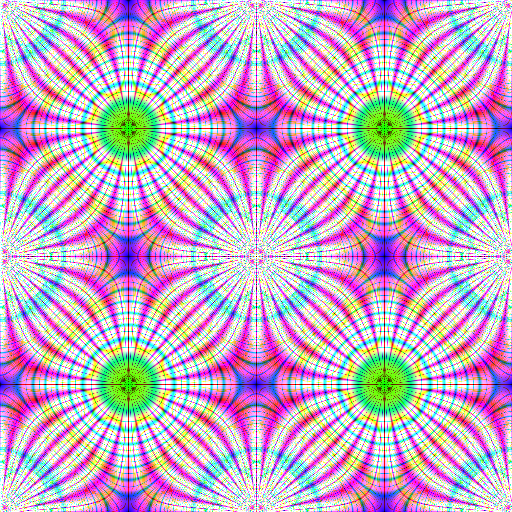
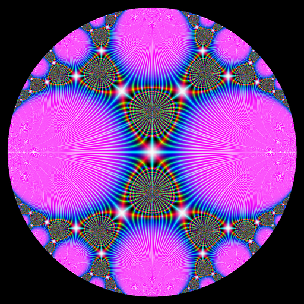
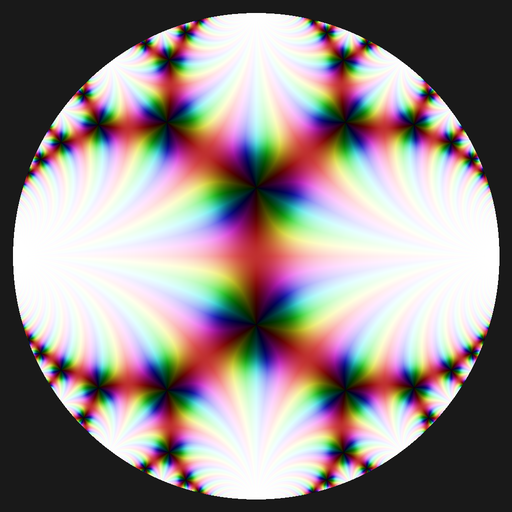

# HaskellImages

*Domain coloring using the 'hip' library*

___

This package is still under construction but it is already useable. 
An easy way to use it is to make a module with this preamble:

```haskell
import ColorMaps
import SaveImage
import Data.Complex 
```

Then you have to define a `Func` function; this type is defined as follows:

```haskell
type Func = Complex Double -> Maybe (Complex Double)
```

`Maybe` is used to "ignore" some pixels. For example if you want to plot a function 
on a circle, you'll attribute `Nothing` to the points outside this circle. 
The color of the corresponding pixels is controlled by the *color map*. 
This package defines the type `ColorMap`:

```haskell
type ColorMap = Maybe (Complex Double) -> Pixel RGB Double
```

The value corresponding to `Nothing` of a color map is the color of the 
"ignored" pixels.

An image is defined by:

- a `Func` function;
- a color map;
- the x-limits and the y-limits of the rectangular region on which we want to plot the function;
- the dimensions of the image (width and height), in pixels.

Let's show an example. We take a function we want to plot on the unit circle:

```haskell
module Example 
  where
import ColorMaps
import SaveImage
import Data.Complex 

cayley :: Func
cayley z = 
    if magnitude z >= 1
        then Nothing
        else Just $ im + (2*im*z) / (im - z)
    where
        im = 0 :+ 1

save :: ColorMap -> IO ()
save cmap = 
    saveImage cayley (512, 512) (-1, 1) (-1, 1) cmap "images/Cayley.png"
```

Four color maps are provided by the package, named `colorMap1`, ..., `colorMap4`. 
The third one depends on two parameters, it has type 

```haskell
   Double -- saturation, between 0 and 1
-> Double -- should be an integer
-> ColorMap 
```

Now load the above module in GHCI and run for example `save colorMap1`. 
You'll get this image:


This example is not very exciting. If you want a funny one, you can try:

```haskell
f :: Complex Double -> Complex Double
f z = 1728 * (z * (z**10 + 11 * z**5 - 1))**5 / 
    (-(z**20 + 1) + 228 * (z**15 - z**5) - 494 * z**10)**3

f1 :: Func
f1 z = Just $ f z

f2 :: Func
f2 z = Just $ f $ f z

save :: Func -> IO ()
save func = 
    saveImage func (512, 512) (-5, 5) (-5, 5) colorMap4 "func.png"
```

___

You can also get the image in Haskell and play with it, e.g. by applying filters. 
Use the `myImage` function of this package to get the image:

```haskell
myimage = myImage func (512, 512) (-1, 1) (-1, 1) colorMap1
```

Let's see an example, with the Weierstrass p-function.

```haskell
import Data.Complex ( Complex(..) )
import SaveImage (myImage)
import Math.Weierstrass (weierstrassP)
import ColorMaps (colorMap1)
import Graphics.Image hiding (magnitude)

-- the 'Func'
wp :: Complex Double -> Maybe (Complex Double)
wp z = Just $ weierstrassP z (0.5 :+ 0.0) (0.0 :+ 0.5)

-- make image
myimage :: Image VU RGB Double
myimage = myImage wp (512, 512) (-1, 1) (-1, 1) colorMap1

saveMyImage :: IO ()
saveMyImage = writeImage "images/wp.png" myimage
```


Now we apply a filter, the Sobel operator:

```haskell
myfilteredImage :: Image VU RGB Double
myfilteredImage = sobelOperator myimage

saveMyFilteredImage :: IO ()
saveMyFilteredImage = writeImage "images/wp_sobel.png" myfilteredImage
```



The Laplacian filter also gives an interesting result:

```haskell
lapimg = applyFilter (laplacianFilter Edge) myimage

displayImage lapimg
```


As you can see, there is plenty to enjoy (especially with the elliptic functions).

___

## Gallery

Here are some images obtained with this package.







